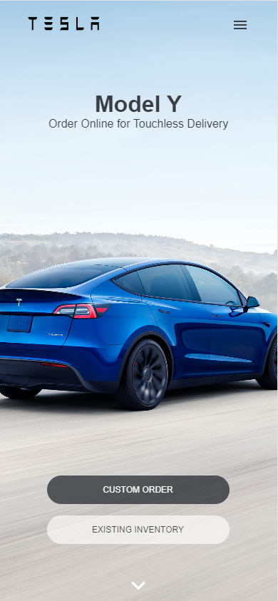

<br/>
<div align="center">
  <a href="">
    
  </a>

  <h1 align="center">Tesla Clone Website</h1>

  <p align="center">
    <a href="https://tesla-clone-react-ts-rf.netlify.app/"><strong>Live Website »</strong></a>
    <br/>
    <br/>
  </p>
</div>

<details>
  <summary>Table of Contents</summary>
  <ol>
    <li>
      <a href="#about-project">About Project</a>
    </li>
    <li>
      <a href="#screenshots">Screenshots</a>
    </li>
    <li><a href="#tech-stack">Tech Stack</a></li>
    <li>
      <a href="#installation">Installation</a>
    </li>
  </ol>
</details>
 <br />

## About Project

Basic clone of Tesla website built using React JS and Typescript, designed using Styled Components. Website is fully responsive and uses reusable components that take certain props. Each section is animated using React Awesome Reveal.

## Screenshots


 &nbsp;  

## Tech Stack

- 
- 
- 
- 
- React Icons
- React Awesome Reveal

## Installation

To get started with this project, simply clone the repository:

```bash
git clone https://github.com/Vertori/tsl-cln-react-typescript.git
```

Use the package manager [npm](https://www.npmjs.com/) to install the dependencies.

```bash
npm install
```

After that, run the following command to start the development server:

```bash
npm run dev
```
